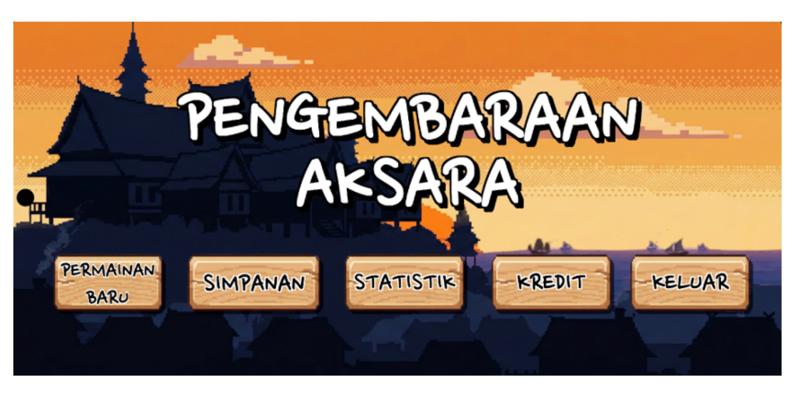
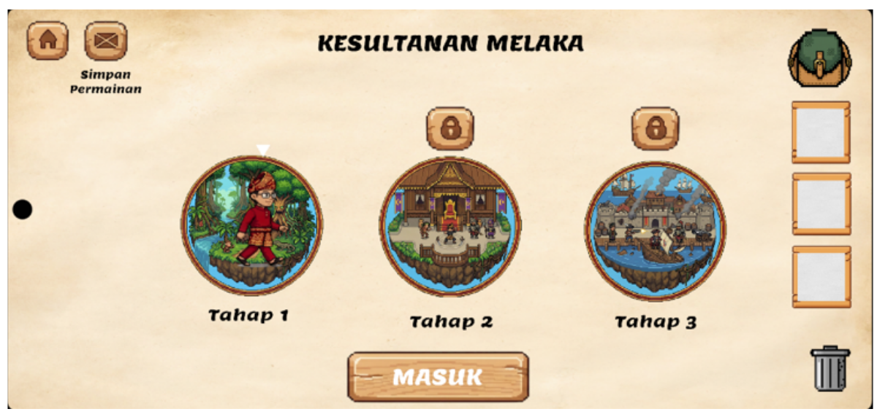

# 🗡️ Pengembaraan Aksara: The Word-Building RPG 📜

**Pengembaraan Aksara** is a 2D pixel-art mobile RPG developed to revolutionize Malay vocabulary learning. Take control of Arif as you explore the rich history of the Sultanate of Melaka, engaging in tactical turn-based combat by forming valid Malay words to defeat folklore-inspired enemies and save the realm!

---

## ✨ Key Features

* 🔠 **Innovative Word-Building Combat:** Strategic turn-based battle loop where players defeat enemies by forming valid Malay words from a dynamically generated 5x5 grid of letter tiles.
* 🗣️ **Real-Time Audio Feedback (TTS):** Integrated with Google Cloud Text-to-Speech API to instantly vocalize correct spellings, reinforcing pronunciation and vocabulary retention.
* 🧠 **Smart Vowel Algorithm:** Custom letter generation logic that guarantees at least a 50% vowel ratio per round, ensuring players can consistently form playable syllables.
* 🏰 **Culturally Rich Narrative:** Experience an engaging storyline rooted in Malay folklore and history, brought to life with dynamic cutscenes and a visually appealing retro 16-bit 2D pixel art style.
* 💾 **Robust Offline Architecture:** Fully playable offline, utilizing a highly responsive local dictionary (`kamus.txt`) of over 40,000 words validated via HashSet, and a secure JSON local storage system.
* 🏆 **Dynamic Progression:** Deep RPG mechanics including EXP leveling, health potion inventory, elemental attacks based on word length, and a dynamic local leaderboard.

---

## 🛠️ Tech Stack

### Game Engine & API
* **Engine:** Unity 2D (Version 6)
* **Language:** C#
* **Audio Integration:** Google Cloud Text-to-Speech (TTS) API
* **Platform:** Android Mobile

### Data & Architecture
* **Database:** Local text database (`kamus.txt`) mapped to HashSet for <0.5s instantaneous lookups
* **Save System:** JSON-based persistent local storage (Player progression, Inventory, Leaderboard)
* **Logic Design:** Finite State Machines (FSM) for turn-based battle management

### UI & Visuals
* **Interface:** Unity Canvas & TextMeshPro
* **Animations:** Frame-by-frame sprite animation using Unity Animator Controller
* **Art Style:** Custom 16-bit retro pixel art

---

## 📸 Screenshots

| Main Menu | World Map Selection | Turn-Based Combat | Treasure Rewards |
| :---: | :---: | :---: | :---: |
|  |  |  |  |

---

## 📥 Try the Prototype (Playable Build)

> **⚠️ Academic Project Disclaimer:** 
> *Pengembaraan Aksara is a Final Year Project (Projek Sarjana Muda) developed by Ahmad Nur Habib Bin Mohd Sidek for academic purposes at the Faculty of Computer Science and Information Technology (FSKTM), Universiti Tun Hussein Onn Malaysia (UTHM). This is a prototype build and **not an official commercial release**.*

If you would like to test the game mechanics, you can download the prototype Android build:

**Step 1: Download the Game**
* Go to the [releases page](../../releases/) of this repository.
* Download the `PengembaraanAksara-v1.0.apk` file to your Android device.

**Step 2: Install the APK**
* Open your device's file manager and tap on the downloaded `.apk` file.
* *Note: You may need to enable "Install from Unknown Sources" in your Android security settings.*

**Step 3: Explore the Mechanics**
* Launch the game, dive into the first level at *Rimba Harapan*, test your vocabulary skills on the 5x5 grid, and defeat the enemies!
